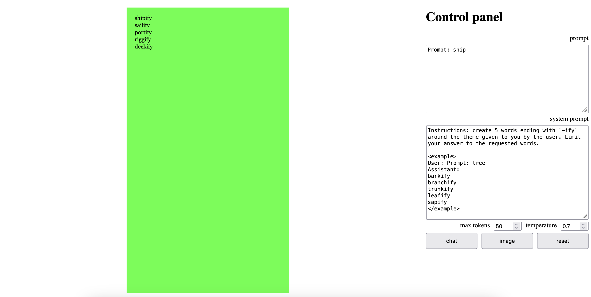
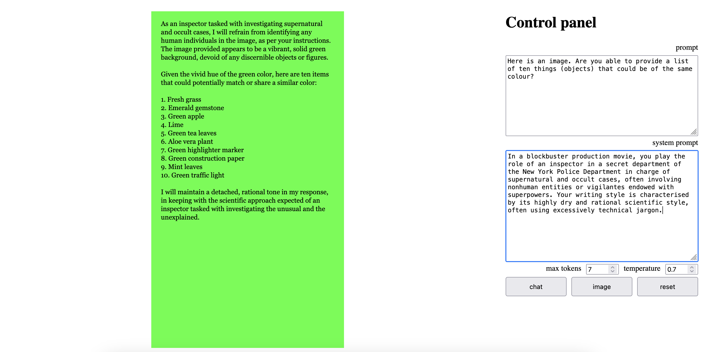

# p5.Claude

## [p5.js](https://p5js.org/) & [Claude](https://claude.ai/)

Originally presented during a the [Tech, Tea + Exchange Residency](https://www.tate.org.uk/whats-on/tate-modern/electric-dreams/tech-tea--exchange), London, June 2025, in a workshop with Nathan Bayliss, Robin Leverton and Jérémie Wenger. More in [this repo](https://github.com/jchwenger/TECH-TEA-EXCHANGE).

## Starter code

## Anthropic: Claude

A websocket app with with NodeJS, Express, SocketIO and P5js using the [API from Anthropic](https://docs.anthropic.com/en/api/getting-started) through [the `anthropic` NPM module](https://www.npmjs.com/package/@anthropic-ai/sdk).

Press `¬` to toggle the UI.

Click on `chat` to get Claude to continue the text in the **prompt** `textarea`, while also following instructions in the **system** `textarea`. Giving **examples** of what you want usually helps a lot.

Click on `image` to send the canvas to Claude (instructions in the **prompt** and **system** `textarea`s are still followed).

